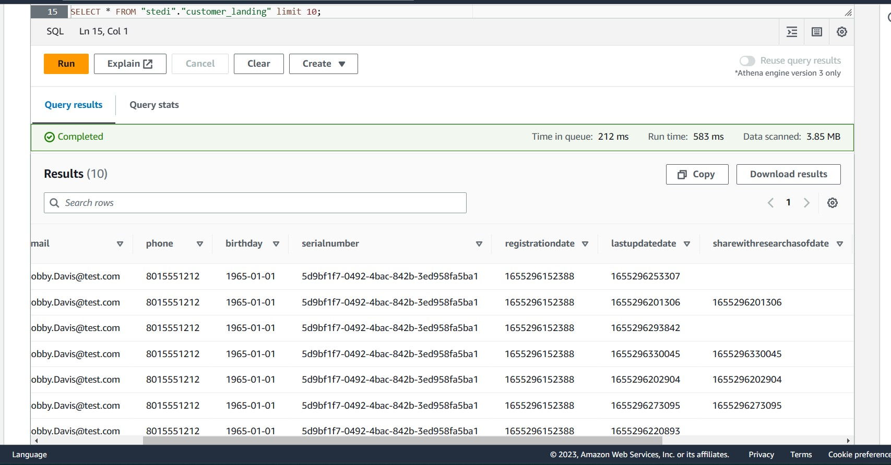

# Ingesting and Organising Data in a Data Lakehouse Using AWS Glue and AWS Athena

## AWS Glue
 - Glue is an AWS Service that relies on Spark. You can use Glue Studio to write purely Spark scripts.
 - Glue is a serverless Spark environment with added libraries like the Glue Context and Glue Dynamic Frames. It also interfaces with other AWS data services like Data Catalog and AWS Athena.

## Configuring AWS Glue: S3 VPC Gateway Endpoint

### Creating an S3 Bucket
- Buckets are storage locations within AWS, that have a hierarchical directory-like structure. Once you create an S3 bucket, you can create as many sub-directories, and files as you want. The bucket is the "parent" of all of these directories and files.
- To create an S3 bucket use the ``aws s3 mb`` command:
- ``aws s3 mb s3://<bucket_name>``

### S3 Gateway Endpoint
- By default, Glue Jobs can't reach any networks outside of your Virtual Private Cloud (VPC). Since the S3 Service runs in different network, we need to create what's called an S3 Gateway Endpoint. This allows S3 traffic from your Glue Jobs into your S3 buckets. Once we have created the endpoint, your Glue Jobs will have a network path to reach S3.
- First use the AWS CLI to identify the VPC that needs access to S3: ``aws ec2 describe-vpcs``
- Locate the *VpcId*

### Routing Table
- Next, identify the routing table you want to configure with your VPC Gateway. Locate the RouteTableId:
- ``aws ec2 describe-route-tables``

### Create an S3 Gateway Endpoint
``aws ec2 create-vpc-endpoint --vpc-id <vpc_id> --service-name com.amazonaws.us-east-1.s3 --route-table-ids <route_table_id>``

### Creating the Glue Service IAM Role
- For AWS Glue to act on your behalf to access S3 and other resources, you need to grant access to the Glue Service by creating an IAM Service Role that can be assumed by Glue:
``aws iam create-role --role-name my-glue-service-role --assume-role-policy-document '{
    "Version": "2012-10-17",
    "Statement": [
        {
            "Effect": "Allow",
            "Principal": {
                "Service": "glue.amazonaws.com"
            },
            "Action": "sts:AssumeRole"
        }
    ]
}'``

### Grant Glue Privileges on the S3 Bucket
``aws iam put-role-policy --role-name my-glue-service-role --policy-name S3Access --policy-document '{ "Version": "2012-10-17", "Statement": [ { "Sid": "ListObjectsInBucket", "Effect": "Allow", "Action": [ "s3:ListBucket" ], "Resource": [ "arn:aws:s3:::<my_bucket_name>" ] }, { "Sid": "AllObjectActions", "Effect": "Allow", "Action": "s3:*Object", "Resource": [ "arn:aws:s3:::<my_bucket_name>/*" ] } ] }'``

### Glue Policy
- Last, we need to give Glue access to data in special S3 buckets used for Glue configuration, and several other resources. Use the following policy for general access needed by Glue:
- ``aws iam put-role-policy --role-name my-glue-service-role --policy-name GlueAccess --policy-document '{
    "Version": "2012-10-17",
    "Statement": [
        {
            "Effect": "Allow",
            "Action": [
                "glue:*",
                "s3:GetBucketLocation",
                "s3:ListBucket",
                "s3:ListAllMyBuckets",
                "s3:GetBucketAcl",
                "ec2:DescribeVpcEndpoints",
                "ec2:DescribeRouteTables",
                "ec2:CreateNetworkInterface",
                "ec2:DeleteNetworkInterface",
                "ec2:DescribeNetworkInterfaces",
                "ec2:DescribeSecurityGroups",
                "ec2:DescribeSubnets",
                "ec2:DescribeVpcAttribute",
                "iam:ListRolePolicies",
                "iam:GetRole",
                "iam:GetRolePolicy",
                "cloudwatch:PutMetricData"
            ],
            "Resource": [
                "*"
            ]
        },
        {
            "Effect": "Allow",
            "Action": [
                "s3:CreateBucket",
                "s3:PutBucketPublicAccessBlock"
            ],
            "Resource": [
                "arn:aws:s3:::aws-glue-*"
            ]
        },
        {
            "Effect": "Allow",
            "Action": [
                "s3:GetObject",
                "s3:PutObject",
                "s3:DeleteObject"
            ],
            "Resource": [
                "arn:aws:s3:::aws-glue-*/*",
                "arn:aws:s3:::*/*aws-glue-*/*"
            ]
        },
        {
            "Effect": "Allow",
            "Action": [
                "s3:GetObject"
            ],
            "Resource": [
                "arn:aws:s3:::crawler-public*",
                "arn:aws:s3:::aws-glue-*"
            ]
        },
        {
            "Effect": "Allow",
            "Action": [
                "logs:CreateLogGroup",
                "logs:CreateLogStream",
                "logs:PutLogEvents",
                "logs:AssociateKmsKey"
            ],
            "Resource": [
                "arn:aws:logs:*:*:/aws-glue/*"
            ]
        },
        {
            "Effect": "Allow",
            "Action": [
                "ec2:CreateTags",
                "ec2:DeleteTags"
            ],
            "Condition": {
                "ForAllValues:StringEquals": {
                    "aws:TagKeys": [
                        "aws-glue-service-resource"
                    ]
                }
            },
            "Resource": [
                "arn:aws:ec2:*:*:network-interface/*",
                "arn:aws:ec2:*:*:security-group/*",
                "arn:aws:ec2:*:*:instance/*"
            ]
        }
    ]
}'``

#### Copy data to S3
- Use the ``aws s3 cp command``
- ``aws s3 cp <source_data_location_path> <s3_destination_path> --recursive``

## Create Glue Tables
- Go to AWS Glue -> Databases
- Create database
- Go to AWS Glue -> Databases -> Tables
- Create Tables with reference to data location being the bucket where data is stored
- Alternatively you can create tables directly from the Athena query editor

## Querying Glue Tables
- Using the Glue Data Catalog, we can query data using an AWS tool called Athena. The Athena tool is a serverless query service where you can write SQL to run ad-hoc queries on S3 buckets.
- Athena uses S3 to store query results. Set up the location Athena will use to store query results before running any queries
- Go to -> Amazon Athena -> Settings
- Set Query result location as bucket
- Then you can go to the query editor and run your queries

## AWS Glue Jobs
- An AWS Glue job encapsulates a script that connects to your source data, processes it, and then writes it out to your data target. Typically, a job runs extract, transform, and load (ETL) scripts.

## Tasks:

### Landing Zones
- To get a feel for the data you are dealing with in a semi-structured format, create two Glue tables for the two landing zones.
- [customer_landing.sql](scripts/customer_landing.sql)
- [accelerometer_landing.sql](scripts/accelerometer_landing.sql)
 
- **Querying the data using Athena:**
- Accelerometer landing data:
<figure>
  
</figure>
- Customer landing data:
<figure>
  
</figure>

### Trusted Zone
- Sanitize the Customer data from the Website (Landing Zone) and only store the Customer Records who agreed to share their data for research purposes (Trusted Zone) - creating a Glue Table called customer_trusted.
- [customer_landing_to_trusted.py](scripts/customer_landing_to_trusted.py)
- Sanitize the Accelerometer data from the Mobile App (Landing Zone) - and only store Accelerometer Readings from customers who agreed to share their data for research purposes (Trusted Zone) - creating a Glue Table called accelerometer_trusted.
- [accelerometer_landing_to_trusted_zone.py](scripts/accelerometer_landing_to_trusted_zone.py)
- You need to verify your Glue job is successful and only contains Customer Records from people who agreed to share their data. Query your Glue customer_trusted table with Athena
<figure>
  
</figure>

### Curated Zone
- Sanitize the Customer data (Trusted Zone) and create a Glue Table (Curated Zone) that only includes customers who have accelerometer data and have agreed to share their data for research called customers_curated.
- [customer_trusted_to_curated.py](scripts/customer_trusted_to_curated.py)
- Read the Step Trainer IoT data stream (S3) and populate a Trusted Zone Glue Table called step_trainer_trusted that contains the Step Trainer Records data for customers who have accelerometer data and have agreed to share their data for research (customers_curated).
- [step_trainer_landing_to_trusted.py](scripts/step_trainer_landing_to_trusted.py)
- Create an aggregated table that has each of the Step Trainer Readings, and the associated accelerometer reading data for the same timestamp, but only for customers who have agreed to share their data, and make a glue table called machine_learning_curated.
- [trainer_trusted_to_curated.py](scripts/trainer_trusted_to_curated.py)
